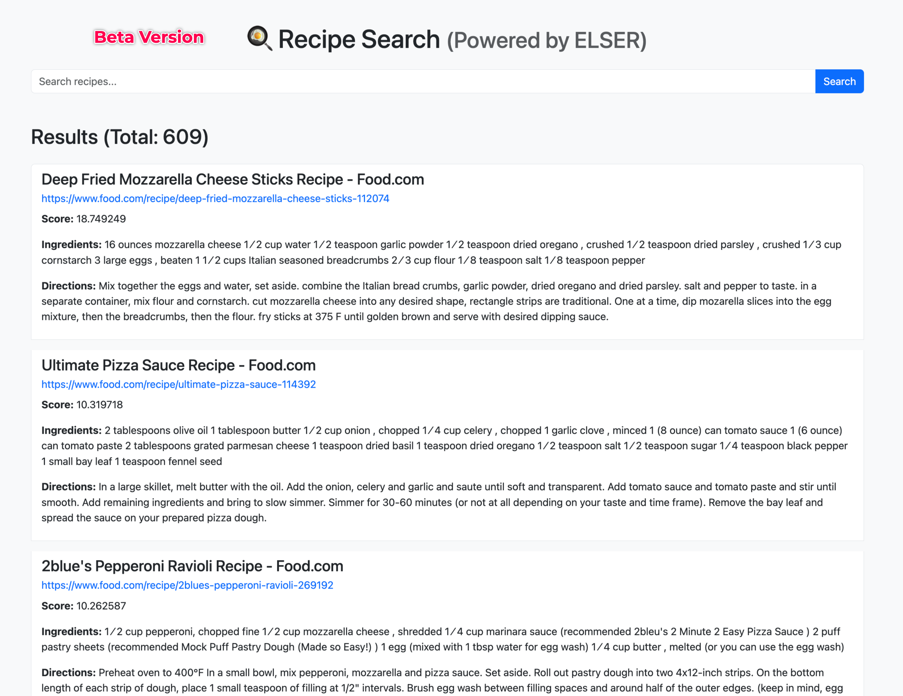

# 📖 Elser Search App (Text Search with Recipe Data)

This project demonstrates **two different approaches** to **text-based recipe search** using **Elasticsearch Search Applications** and **Text Expansion (ELSER)**. The app provides **Flask-based web interfaces** that allow users to search for recipes and view results, including **recipe images, titles, ingredients, directions, and scores**.

---

## 📂 Project Structure

```
.
├── config.py.example         
├── elser_search_app.with_image.py   # Main app using Elasticsearch Search Applications
├── text_expansion_app.beta.py        # App using direct text_expansion queries
├── static/
├── templates/
│   ├── search.beta.html         # Template for text_expansion_app
│   └── search.with_image.html   # Template for elser_search_app (includes recipe images)
└── readme.md
```

---

## 🚀 Applications Overview

### 1. **Elser Search App (with Recipe Images)**

- **File:** `elser_search_app.with_image.py`
- **Description:**  
  Uses **Elasticsearch Search Applications** for **basic text search** (no embeddings or image similarity), but **displays recipe images** alongside:
  - **Recipe image**
  - **Title**
  - **Url**
  - **Score**
  - **Ingredients**
  - **Directions**
<br>

- **Output Example:**

  

- **HTML Template:**  
  Uses `templates/search.with_image.html`.

- **Sparse Vector Queries**

```
POST {index_name}/_search
{
  "_source": ["title", "directions", "ingredients", "url", "image"],
  "query": {
    "sparse_vector": {
      "field": "ml.inference.directions_expanded.predicted_value",
      "inference_id": ".elser_model_2_linux-x86_64",
      "query": "pizza mozzarella"
    }
  }
}
```


---

### 2. **(Deprecated) Text Expansion App (No Images)**

Refer here: [Deprecation details on Text Expansion Query](https://www.elastic.co/docs/reference/query-languages/query-dsl/query-dsl-text-expansion-query)

- **File:** `text_expansion_app.beta.py`
- **Description:**  
  Performs **direct queries using the `text_expansion` query** with the **ELSER model** (deprecated approach).  
  **Displays:**
  - **Title**
  - **Url**
  - **Score**
  - **Ingredients**
  - **Directions**

  (No images in the output.)
<br>

- **Output Example:**

  

- **HTML Template:**  
  Uses `templates/search.beta.html`.

- **Queries**

```
POST {index_name}/_search
{
  "_source": [
    "title", "directions", "ingredients", "url"
  ],
  "query": {
    "bool": {
      "should": [
        {
          "text_expansion": {
            "ml.inference.directions_expanded.predicted_value": {
              "model_id": ".elser_model_2_linux-x86_64",
              "model_text": "Indian pizza spicy tasty"
            }
          }
        }
      ]
    }
  }
}
```
---

## 📝 Notes

- **Elser Search App** uses **Search Applications** in Elasticsearch, making use of a **search template**.
- **Text Expansion App** uses **hardcoded `text_expansion` queries** with the **ELSER model**.
- **Images in search results** only appear in the **Elser Search App**, not in the **Text Expansion App**.

---

## 📸 Screenshots

| **Elser Search App (with images)** | **Text Expansion App (no images)** |
|-------------------------------------|------------------------------------|
|  |  |

---