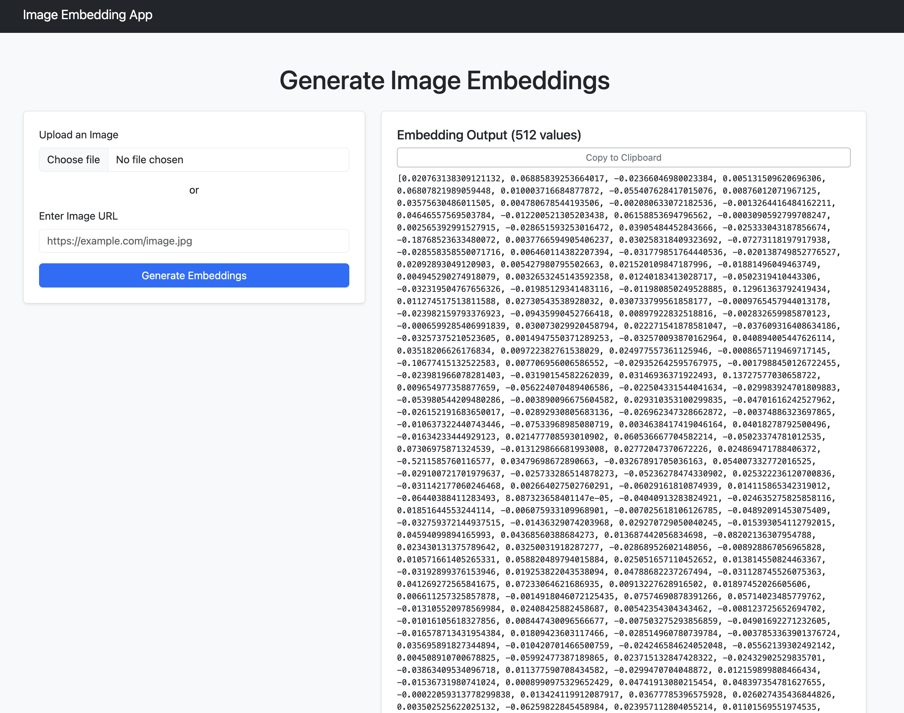

# Generate Image Embedding App

A simple **Flask** web app to generate **512-dimensional embeddings** for images using **OpenAI's CLIP model**. Upload an image or provide an image URL, and get the embeddings displayed with a **copy to clipboard** feature.

---

## Features

- Upload image or paste image URL.
- Generates **CLIP embeddings** (512 dimensions).
- **Copy to clipboard** functionality.
- Clean **Bootstrap 5** UI.

---

## Quick Start

1. Clone & navigate:
   ```bash
   git clone https://github.com/your-username/image-embedding-app.git
   cd image-embedding-app
   ```

2. Set up virtual environment:
   ```bash
   python3 -m venv venv
   source venv/bin/activate  # Windows: venv\Scripts\activate
   ```

3. Install dependencies:
   ```bash
   pip install -r requirements.txt
   ```

4. Run the app:
   ```bash
   python app.py
   ```

Visit: **http://127.0.0.1:5001**

> [!Note]
> `app.run(debug=True, host='0.0.0.0', port=5001)` I have modified the port so, visit to the browser based on your preference.

---

## Example



---

## License

**MIT License**. See [LICENSE](LICENSE) for details.