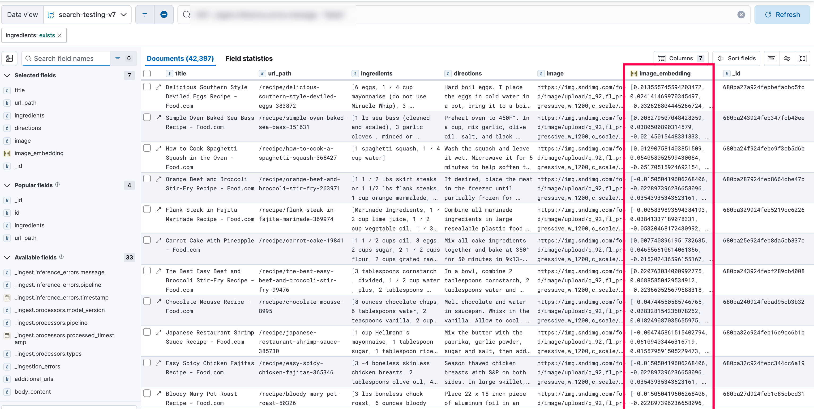

# Embedding Updater for Elasticsearch

This script reads a CSV file of recipe documents, downloads their associated image URLs, generates OpenAI CLIP embeddings, and updates the documents in an Elasticsearch index.

## Features

- Uses `asyncio` + `aiohttp` for parallel image fetching and embedding generation
- Embeddings are generated using `openai/clip-vit-base-patch32`
- Document updates are sent to an existing Elasticsearch index
- Progress is tracked using `tqdm`
- Status of each update is saved back to the CSV

## Expected Output

```
Using a slow image processor as `use_fast` is unset and a slow processor was saved with this model. `use_fast=True` will be the default behavior in v4.52, even if the model was saved with a slow processor. This will result in minor differences in outputs. You'll still be able to use a slow processor with `use_fast=False`.
Available columns: ['_id', 'title', 'url_path', 'ingredients', 'directions', 'image', 'image_embedding', 'status']
  0%|          | 0/42400 [00:00<?, ?it/s][Pick] Document: 680ba243924feb347fcb40ee | Image URL: https://img.sndimg.com/food/image/upload/q_92,fl_progressive,w_1200,c_scale/v1/img/recipes/35/16/31/TW8kFVRNTwKckUevzMv7_sea-bass-recipe-5393.jpg
[Pick] Document: 680ba243924febf289cb4008 | Image URL: https://img.sndimg.com/food/image/upload/q_92,fl_progressive,w_1200,c_scale/v1/img/recipes/99/47/6/01z114QRWGncDabUUJod_0S9A5937.jpg
[Pick] Document: 680ba240924febad95cb3b32 | Image URL: https://img.sndimg.com/food/image/upload/q_92,fl_progressive,w_1200,c_scale/v1/img/recipes/89/95/omZbv836RCmfVJbCHwx8-Chocolate-Mousse---8995--1.JPG
[Pick] Document: 680ba24c924feb1ba6cb55f1 | Image URL: -
[Skip] Invalid URL for document 680ba24c924feb1ba6cb55f1. Skipping.
[Pick] Document: 680ba25e924feb8da5cb837c | Image URL: https://img.sndimg.com/food/image/upload/q_92,fl_progressive,w_1200,c_scale/v1/img/recipes/19/84/1/TvOnvpOTwKdXtHZ92oko_carrot-cake-natural-cream-cheese-frosting-9015.jpg
[Pick] Document: 680ba27d924feb1c85cbcd31 | Image URL: https://img.sndimg.com/food/image/upload/q_92,fl_progressive,w_1200,c_scale/v1/gk-static/fdc-new/img/fdc-shareGraphic.png
[Pick] Document: 680ba246924feb428bcb46bf | Image URL: https://img.sndimg.com/food/image/upload/q_92,fl_progressive,w_1200,c_scale/v1/img/recipes/63/78/6/NrPa79ZESEOqMlMoFDos_fajitas-3.jpg
[Pick] Document: 680ba25f924feb99adcb869f | Image URL: https://img.sndimg.com/food/image/upload/q_92,fl_progressive,w_1200,c_scale/v1/img/recipes/10/58/65/G9Ez7rFmQOmtdHERTPgK_AWC%204%20-%20final_2.png
[Pick] Document: 680ba239924febe080cb2f60 | Image URL: -
[Skip] Invalid URL for document 680ba239924febe080cb2f60. Skipping.
[Pick] Document: 680ba240924febf401cb3ac2 | Image URL: -
[Skip] Invalid URL for document 680ba240924febf401cb3ac2. Skipping.
[Pick] Document: 680ba282924febbfb8cbdb09 | Image URL: https://img.sndimg.com/food/image/upload/q_92,fl_progressive,w_1200,c_scale/v1/img/recipes/19/84/57/picWXOhug.jpg
[Pick] Document: 680ba281924febb134cbd5c5 | Image URL: https://img.sndimg.com/food/image/upload/q_92,fl_progressive,w_1200,c_scale/v1/img/recipes/82/17/5/vRMPuxgRaiQj1PbaeBOT_PUDDING3.jpg
[Pick] Document: 680ba27a924febbefacbc5fc | Image URL: https://img.sndimg.com/food/image/upload/q_92,fl_progressive,w_1200,c_scale/v1/img/recipes/38/38/72/picLb0wDa.jpg
[Pick] Document: 680ba31a924feb919bcc3d7f | Image URL: https://img.sndimg.com/food/image/upload/q_92,fl_progressive,w_1200,c_scale/v1/img/recipes/73/82/5/VIfjsbVmSubdAsbjKPXX_0S9A1692.jpg
[Pick] Document: 680ba31e924febec90cc4798 | Image URL: https://img.sndimg.com/food/image/upload/q_92,fl_progressive,w_1200,c_scale/v1/img/recipes/52/10/4/picwrQHAm.jpg
[Pick] Document: 680ba287924feb8664cbe47b | Image URL: https://img.sndimg.com/food/image/upload/q_92,fl_progressive,w_1200,c_scale/v1/gk-static/fdc-new/img/fdc-shareGraphic.png
[Pick] Document: 680ba244924feb79bfcb42ff | Image URL: https://img.sndimg.com/food/image/upload/q_92,fl_progressive,w_1200,c_scale/v1/img/recipes/39/01/3/aeAtoOWHSeWQh9UD7W3K_0S9A6192.jpg
[Pick] Document: 680ba24f924febc9f3cb5d6b | Image URL: https://img.sndimg.com/food/image/upload/q_92,fl_progressive,w_1200,c_scale/v1/img/recipes/36/84/27/picbyyVrF.jpg
[Pick] Document: 680ba24c924febd5edcb56c7 | Image URL: https://img.sndimg.com/food/image/upload/q_92,fl_progressive,w_1200,c_scale/v1/img/recipes/40/86/05/picyGNkdf.jpg
[Pick] Document: 680ba329924feb5219cc6226 | Image URL: https://img.sndimg.com/food/image/upload/q_92,fl_progressive,w_1200,c_scale/v1/img/recipes/36/99/74/picLCJ98x.jpg
[Pick] Document: 680ba32c924febc344cc6a19 | Image URL: https://img.sndimg.com/food/image/upload/q_92,fl_progressive,w_1200,c_scale/v1/gk-static/fdc-new/img/fdc-shareGraphic.png
[Pick] Document: 680ba32c924feb16c9cc6b1b | Image URL: https://img.sndimg.com/food/image/upload/q_92,fl_progressive,w_1200,c_scale/v1/img/recipes/38/57/30/picXZxYEr.jpg
[Pick] Document: 680ba329924febddbbcc637a | Image URL: https://img.sndimg.com/food/image/upload/q_92,fl_progressive,w_1200,c_scale/v1/gk-static/fdc-new/img/fdc-shareGraphic.png
[Success] ✅ Updated document: 680ba244924feb79bfcb42ff
[Success] ✅ Updated document: 680ba27a924febbefacbc5fc
[Pick] Document: 680ba28f924feb2bafcbfb7d | Image URL: https://img.sndimg.com/food/image/upload/q_92,fl_progressive,w_1200,c_scale/v1/gk-static/fdc-new/img/fdc-shareGraphic.png
[Pick] Document: 680ba292924feb8a80cc02dd | Image URL: https://img.sndimg.com/food/image/upload/q_92,fl_progressive,w_1200,c_scale/v1/img/recipes/10/88/08/1VGdwWhTeaTb4qU5Y8XR_IMG_0948.JPG
[Success] ✅ Updated document: 680ba243924feb347fcb40ee
[Success] ✅ Updated document: 680ba24f924febc9f3cb5d6b
[Pick] Document: 680ba323924febff40cc536e | Image URL: https://img.sndimg.com/food/image/upload/q_92,fl_progressive,w_1200,c_scale/v1/img/recipes/26/54/6/pic2ZaPYI.jpg
[Pick] Document: 680ba328924feb7acacc5ed1 | Image URL: https://img.sndimg.com/food/image/upload/q_92,fl_progressive,w_1200,c_scale/v1/img/recipes/20/40/69/picPxokZC.jpg
[Success] ✅ Updated document: 680ba287924feb8664cbe47b
[Success] ✅ Updated document: 680ba329924feb5219cc6226
[Success] ✅ Updated document: 680ba25e924feb8da5cb837c
[Pick] Document: 680ba287924feb00b2cbe599 | Image URL: https://img.sndimg.com/food/image/upload/q_92,fl_progressive,w_1200,c_scale/v1/img/recipes/17/83/94/pic7vWhSm.jpg
[Pick] Document: 680ba284924febd766cbded5 | Image URL: https://img.sndimg.com/food/image/upload/q_92,fl_progressive,w_1200,c_scale/v1/gk-static/fdc-new/img/fdc-shareGraphic.png
[Pick] Document: 680ba292924feb2121cc0394 | Image URL: https://img.sndimg.com/food/image/upload/q_92,fl_progressive,w_1200,c_scale/v1/img/recipes/79/50/6/picqki36G.jpg
[Success] ✅ Updated document: 680ba243924febf289cb4008
[Success] ✅ Updated document: 680ba240924febad95cb3b32
[Success] ✅ Updated document: 680ba32c924feb16c9cc6b1b
[Success] ✅ Updated document: 680ba32c924febc344cc6a19
[Success] ✅ Updated document: 680ba27d924feb1c85cbcd31
[Success] ✅ Updated document: 680ba28f924feb2bafcbfb7d
[Success] ✅ Updated document: 680ba292924feb8a80cc02dd

```

## Expected Results in Elasticsearch



## License

**MIT License**. See [LICENSE](LICENSE) for details.