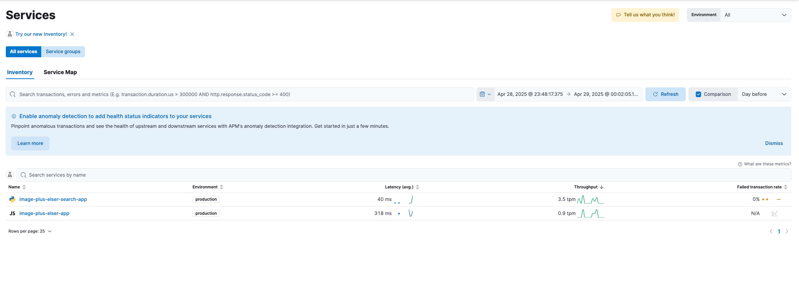
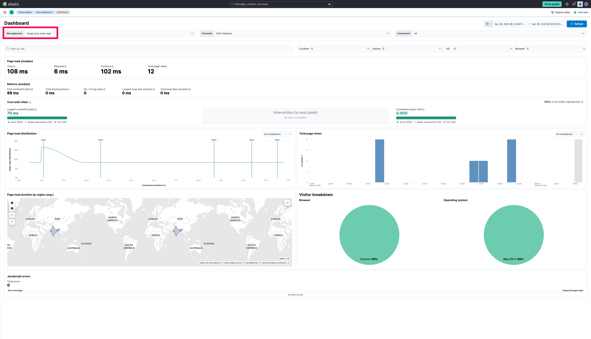

# Image + Elser Recipe Search App with Elastic APM & RUM Integration

> [!Important]
> Refer to the directories: elser_search and image_search templates for more details on how we are landing here and rendering results.

This is a **Flask-based web application** that allows you to search for recipes using two methods:
1. **Text Search** (powered by Elasticsearch Search Applications with ELSER model).
2. **Image Search** (powered by OpenAI's CLIP model for generating image embeddings and KNN search in Elasticsearch).

The application also integrates:
- **Elastic APM (Application Performance Monitoring)** for backend monitoring.
- **Elastic RUM (Real User Monitoring)** for frontend performance insights.

---

## Features 

- **Search by Text:**  
  Search recipes based on keywords using Elasticsearch's **Search Applications** and **ELSER** model.

- **Search by Image:**  
  Upload an image or provide an image URL, and the app generates embeddings using **OpenAI CLIP** and searches similar recipes using **KNN (k-nearest neighbors)** in Elasticsearch.

- **Elastic APM Integration (Backend):**  
  Tracks performance, errors, and transactions for Flask routes.

- **Elastic RUM Integration (Frontend):**  
  Captures frontend performance metrics, user interactions, and JavaScript errors.

- **[WIP] Pagination Support:**  
  For text search results, with a dynamic pagination bar (first page, nearby pages, ellipsis, last page).

---

## Project Structure

```
image_plus_elser_search/
├── config.py                       # Config variables 
├── image_plus_elser_app.py         # Actual Flask application
├── readme.md                 
├── static/                         # Added Static assets
│   ├── elastic-apm-rum.umd.min.js  # Elastic RUM agent (using a local copy optionally)
│   └── styles.css                  #  CSS for the htmls
└── templates/                      # Jinja2 templates for rendering HTML
    └── image_plus_elser_app/
        ├── elser_search.html       # html for text search results
        ├── home.html               # Home page html
        └── image_search.html       # html for image search results
```

---

## Prerequisites

1. **Elasticsearch Cloud Deployment**  
   - Index with **512-dimensional dense vector field** for image embeddings.
   - Search Application for text-based queries.

2. **CLIP Model:**  
   - Uses OpenAI's `clip-vit-base-patch32` via Hugging Face Transformers or choose any CLIP models that gives you image embeddings.

3. **Elastic APM & RUM:**  
   - APM server setup for backend monitoring.
   - RUM configuration for frontend monitoring.

4. **Index Mapping (for vector search):**  
Ensure your index has a field like:

```json
"image_embedding": {
  "type": "dense_vector",
  "dims": 512,
  "index": true
}
```

You can verify with:
```bash
GET <your-index>/_mapping
```

---

## Setup & Run

1. **Clone the repo**  
```bash
git clone <repo-url>
cd image_plus_elser_search
```

2. **Create a virtual environment & install dependencies**  
```bash
python -m venv venv
source venv/bin/activate
pip install -r requirements.txt
```

3. **Configure `config.py`:**  
```python
# Elasticsearch
ELASTIC_URL = "https://<your-elasticsearch-url>"
ELASTIC_API_KEY = "<your-api-key>"
INDEX_NAME = "{index_name}"
SEARCH_APPLICATION_NAME = "recipe_search_app"
IMAGE_SEARCH_TEMPLATE = "image_search_template"

# CLIP Model
CLIP_MODEL_NAME = "openai/clip-vit-base-patch32"
KNN_K = 8
KNN_NUM_CANDIDATES = 50
KNN_SEARCH_FIELDS = ["title", "directions", "ingredients", "body_content"]
KNN_FIELD = "image_embedding"

# APM (Backend)
APM_SERVICE_NAME = "image-plus-elser-app"
APM_SERVER_URL = "https://<your-apm-server-url>"
APM_SECRET_TOKEN = "<your-apm-secret-token>"
APM_APP_ENVIRONMENT = "production"

# RUM (Frontend)
RUM_SERVICE_NAME = "image-plus-elser-app"
RUM_SERVER_URL = "https://<your-apm-server-url>"
RUM_ENVIRONMENT = "production"
```

4. **Run the app**  
```bash
python image_plus_elser_app.py
```

5. **Access it:**  
Open [http://127.0.0.1:5000/](http://127.0.0.1:5000/) in your browser.

---

## 🖼️ Image Search Workflow

1. **Upload an image** or **provide an image URL**.
2. The `generate_embeddings()` generates a **512-dimensional embedding** using **OpenAI CLIP**.
3. The embedding is sent to Elasticsearch to perform a **KNN search**.
4. Results include:
   - Recipe title
   - Directions
   - Ingredients
   - Image preview
   - Score
   - Url

---

## 🔍 Text Search Workflow (ELSER Search)

1. Enter a **text query** (like anything from ingredient, recipe name).
2. Elasticsearch's **Search Application** (backed by **ELSER model**) fetches relevant recipes.

---

## APM & RUM Setup

### Backend (APM):
- Integrated with Flask via `elastic-apm` Python agent.
- Monitors transactions, errors, response times.

### APM Services List:




### Frontend (RUM):
- Configured in the HTML templates (`home.html`, etc.).
- Captures frontend metrics (page load times, errors).

### RUM Dashboard:




Example in `home.html`:
```html
<script src="https://cdn.jsdelivr.net/npm/@elastic/apm-rum@5.12.0/dist/bundles/elastic-apm-rum.umd.min.js" crossorigin></script>
<script>
  elasticApm.init({
    serviceName: "{{ rum_service_name }}",
    serverUrl: "{{ rum_server_url }}",
    environment: "{{ rum_environment }}",
    distributedTracingOrigins: [window.location.origin]
  });
</script>
```

---

## References

- [Elasticsearch Search Applications](https://www.elastic.co/docs/solutions/search/search-applications)
- [OpenAI CLIP](https://huggingface.co/openai/clip-vit-base-patch32)
- [Elastic APM Python Agent](https://www.elastic.co/guide/en/apm/agent/python/current/index.html)
- [Elastic APM RUM Agent](https://www.elastic.co/docs/reference/apm/agents/rum-js)

----