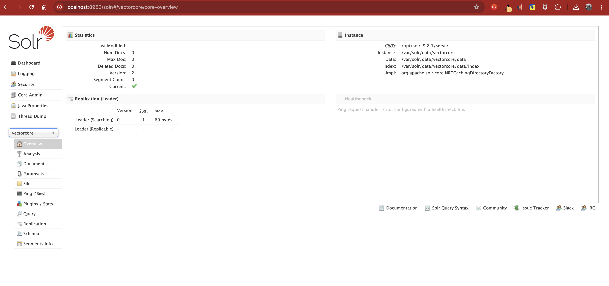
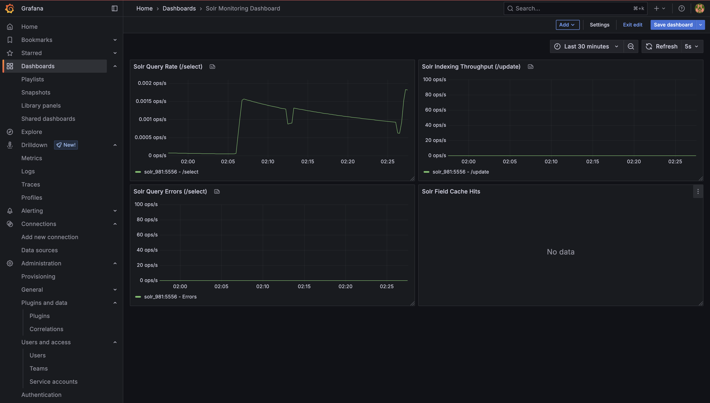
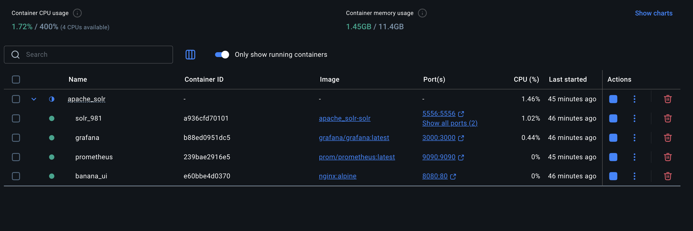
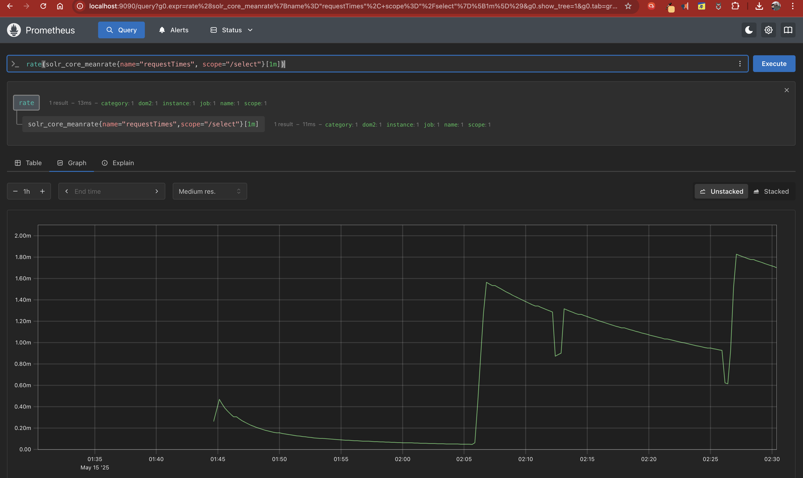

# Quickstart & Feature Comparison with Elasticsearch

**Solr Version:** 9.8.1 (recently released on March 12th)
**GitHub of Solr repo:** https://github.com/apache/solr
**License:** Apache 2.0
**Maven repository:** https://mvnrepository.com/artifact/org.apache.solr/solr-core
**Built on top of:** [Solr 9.8.1](https://mvnrepository.com/artifact/org.apache.solr/solr-core/9.8.1#:~:text=org.apache.lucene%20%C2%BB%20lucene%2Dcore) uses `Apache Lucene 9.11.1` whereas the [Elasticsearch 9.0.1](https://mvnrepository.com/artifact/org.elasticsearch/elasticsearch/9.0.1#:~:text=org.apache.lucene%20%C2%BB%20lucene%2Dcore) is already using `Apache Lucene 10.1.0`

---

## User Experience

The learning curve is **very high** for `Solr` as it relies heavily on low-level APIs. The Admin UI is **very basic**:



Solr lacks a native dashboard or integrated client for visualization like `Kibana`. Instead, you can use:

* **Banana UI**, built by **Lucidworks**, which collaborated closely with Apache Solr.
* **Grafana** by integrating:

  * `JMX Exporter` (scrapes Solr JVM metrics)
  * `Prometheus` (as a time series DB)
  * `Grafana` (connects to Prometheus as a data source)

This setup is non-trivial and requires a decent understanding of monitoring architecture.

Note: In `Grafana`, you'll need to either import existing dashboards and customize them based on your specific queries and the available metrics. This process involves a learning curve along with `Solr`.

---

## Vector Search in Solr

Solr supports dense vector search, but it requires a custom XML schema configuration similar to Elasticsearch's `mappings`.

Reference: [https://solr.apache.org/guide/solr/latest/query-guide/dense-vector-search.html](https://solr.apache.org/guide/solr/latest/query-guide/dense-vector-search.html)

**Example schema:**

```xml
<fieldType name="knn_vector" class="solr.DenseVectorField" vectorDimension="4" similarityFunction="cosine"/>
<field name="vector" type="knn_vector" indexed="true" stored="true"/>
```

Data must be ingested into Solr with these defined fields before performing vector search.

---

## Query Load Example

Use the following URL to create load in Apache Solr:

```
http://localhost:8983/solr/vectorcore/select?q=*:*  
```

**Sample response:**

```json
{
  "responseHeader":{
    "status":0,
    "QTime":0,
    "params":{
      "q":"*:*"
    }
  },
  "response":{
    "numFound":0,
    "start":0,
    "numFoundExact":true,
    "docs":[]
  }
}
```

---

## Prometheus Queries

Example queries to validate Solr metrics:

```promql
solr_core_meanrate
up{job="solr"}
timestamp(solr_core_meanrate)
rate(solr_core_meanrate{name="requestTimes", dom2="vectorcore"}[1m])
rate(solr_core_meanrate{name="errors"}[1m])
```

**Working PromQL Query:**

```promql
rate(solr_core_meanrate{name="requestTimes", scope="/select"}[1m])
```

---

## Sample Visualizations

**Grafana Dashboard Panel:**



**Docker Setup for Solr Monitoring Stack:**



**Prometheus Query Execution:**



---

## Further Reference

Refer to the full set of metrics exported from Solr including JMX via:

```
oss-eval/apache_solr/assets/solr_plus_jmx_metrics.log
```
