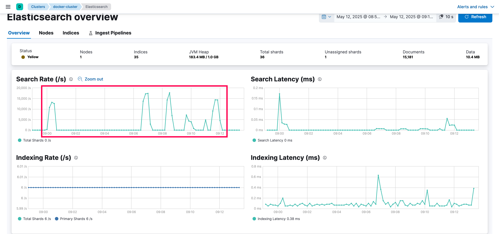
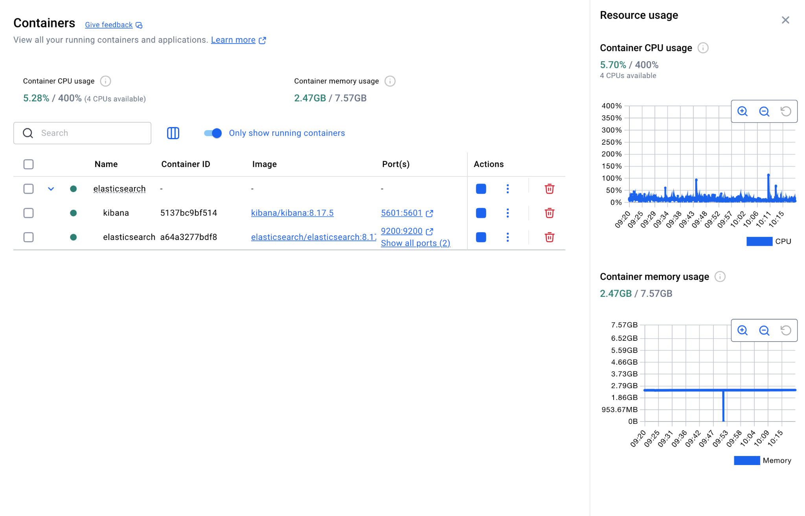

### Elasticsearch benchmarks:

- Version: `8.17.5`

- Official Elasticsearch benchmarks: https://elasticsearch-benchmarks.elastic.co/#tracks/msmarco-passage-ranking/nightly/default/90d

- Maven Repo for dependencies and its Licenses: https://mvnrepository.com/artifact/org.elasticsearch/elasticsearch/8.17.5.
- Maven Repo for dependencies for 9.0.1: https://mvnrepository.com/artifact/org.elasticsearch/elasticsearch/9.0.1

```
REPOSITORY                            TAG       IMAGE ID       CREATED         SIZE
docker.elastic.co/elasticsearch/elasticsearch   8.17.5    c89b92250c55   4 weeks ago     856MB
docker.elastic.co/kibana/kibana                 8.17.5    bfe8876d4d2e   4 weeks ago     1.2GB
```

```
# Indexing requests
curl -s -H "Content-Type: application/x-ndjson" -XPOST localhost:9200/_bulk --data-binary @record/es_bulk_msmarco_10k.jsonl

# Check Index status
curl -s 'localhost:9200/msmarco/_count?pretty' 

# Payload for Search Query
payload
{
  "query": {
    "match": {
      "passage": "what is the eiffel tower"
    }
  }
}
```
## Search Benchmark
### Ab Results for a basic query to Elasticsearch

```
This is ApacheBench, Version 2.3 <$Revision: 1913912 $>
Copyright 1996 Adam Twiss, Zeus Technology Ltd, http://www.zeustech.net/
Licensed to The Apache Software Foundation, http://www.apache.org/

Benchmarking localhost (be patient)


Server Software:        
Server Hostname:        localhost
Server Port:            9200

Document Path:          /msmarco/_search
Document Length:        3734 bytes

Concurrency Level:      50
Time taken for tests:   0.602 seconds
Complete requests:      1000
Failed requests:        431
   (Connect: 0, Receive: 0, Length: 431, Exceptions: 0)
Total transferred:      3846669 bytes
Total body sent:        249000
HTML transferred:       3733669 bytes
Requests per second:    1660.93 [#/sec] (mean)
Time per request:       30.104 [ms] (mean)
Time per request:       0.602 [ms] (mean, across all concurrent requests)
Transfer rate:          6239.32 [Kbytes/sec] received
                        403.88 kb/s sent
                        6643.20 kb/s total

Connection Times (ms)
              min  mean[+/-sd] median   max
Connect:        0    1   0.6      0       4
Processing:     3   28  33.3     21     175
Waiting:        3   28  33.3     21     175
Total:          3   29  33.5     22     176
WARNING: The median and mean for the initial connection time are not within a normal deviation
        These results are probably not that reliable.

Percentage of the requests served within a certain time (ms)
  50%     22
  66%     26
  75%     29
  80%     30
  90%     35
  95%    166
  98%    170
  99%    175
 100%    176 (longest request)
```

### Wrk Results for a basic query in Elasticsearch

```
Running 30s test @ http://localhost:9200/msmarco/_search
  4 threads and 50 connections
  Thread Stats   Avg      Stdev     Max   +/- Stdev
    Latency     3.56ms    2.23ms  37.55ms   80.23%
    Req/Sec     3.53k   421.10     4.68k    80.83%
  422068 requests in 30.02s, 1.51GB read
Requests/sec:  14060.55
Transfer/sec:     51.54MB
```

- Elasticsearch is handling 14,060 queries/sec at ~3.5ms latency.
- Very efficient performance, low latency, minimal variation.
- The system is capable of handling heavy query loads.

### Stack Monitoring



### Docker Stats / Resource Consumption

```
CONTAINER ID   NAME            CPU %     MEM USAGE / LIMIT     MEM %     NET I/O          BLOCK I/O    PIDS 
5137bc9bf514   kibana          6.97%     606.9MiB / 7.752GiB   7.65%     59.4MB / 133MB   0B / 0B      12 
a64a3277bdf8   elasticsearch   2.46%     1.882GiB / 7.752GiB   24.27%    617MB / 7.51GB   0B / 241MB   111 
```

