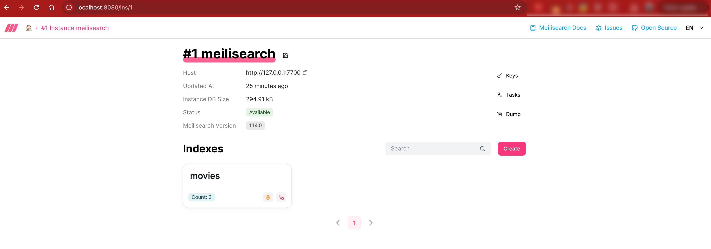
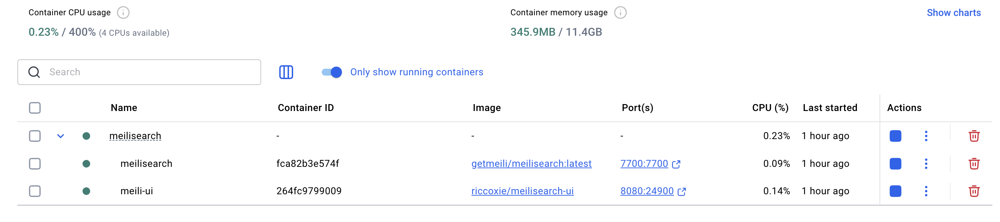
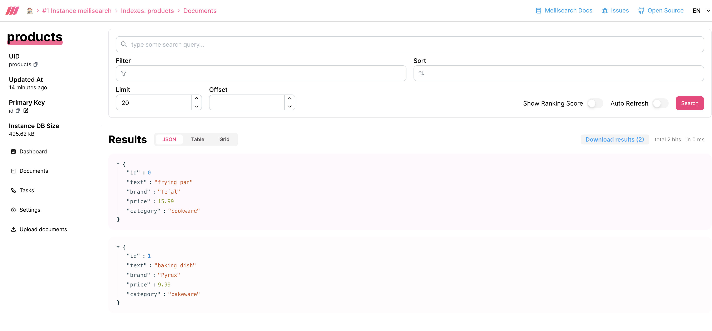

# Meilisearch - Lite and Typo-Tolerant Search



Meilisearch is a `open-source`, `typo-tolerant` search engine built in **Rust**, designed to deliver search experiences with minimal configuration.

This repository documents a local Meilisearch setup, including:
- Local Docker-based deployment
- Custom vector search
- Hybrid semantic search with filters and sorting
- File structure breakdown
- Postman collection for easy testing

---

## Quick Links

- [Meilisearch Cloud](https://www.meilisearch.com/cloud?utm_campaign=oss&utm_source=engine&utm_medium=cli)
- [Documentation](https://www.meilisearch.com/docs)
- [Source Code (GitHub)](https://github.com/meilisearch/meilisearch)
- [Discord Community](https://discord.meilisearch.com)
- License: MIT - No Copy-left restrictions
- [Meilisearch vs Elasticsearch](https://www.meilisearch.com/blog/meilisearch-vs-elasticsearch)

---

## User Experience

* Using Meilisearch with the external `meilisearch-ui` made it significantly easier to create and manage indices. However, the UI currently lacks support for managing vector-specific indices and their associated mappings.
* While Meilisearch is fully open-source under the `MIT license` and offers a lightweight experience, its AI-powered search features are still evolving. Vector search is promising but currently lacks orchestration and operational tooling found in more mature systems.

## Comparison to Elasticsearch

* Cannot compare directly with Elasticsearch, because Elastic seems to be a overkill for `Meilisearch`. It's like comparing `Apples` to `Lemons` as this is built on Rust for quick applications but, it is a bit challenging to scale for big workloads as most of the orchestration had to handled by the end-user.

---

## Pricing Like Algolia


It's more of a `consumption-based` model and there are caps on Indices that can be created as well in most of the consumption-based models.

They offer `Meilisearch Cloud` as mentioned above.

## Local Setup Overview



### Setup Components

- `meilisearch` container (search backend)
- There is no native UI support, however got an community build UI ([riccoxie/meilisearch-ui](https://github.com/riccox/meilisearch-ui)) that works for me.
- Vector search using user-provided embeddings
- Semantic hybrid search with filters/sorting

---

## Storage Structure

Here’s the `meili_data` directory layout after running Meilisearch locally with persistent volumes:

```
meili_data/
├── data.ms
│ ├── VERSION
│ ├── auth/
│ ├── indexes/
│ ├── instance-uid
│ ├── tasks/
│ └── update_files/
└── dumps/
```

### Storage Breakdown

| Path                    | Purpose                              |
| ----------------------- | ------------------------------------ |
| `data.ms/auth`          | Auth tokens & API keys               |
| `data.ms/indexes/`      | Full-text & vector index data        |
| `data.ms/tasks/`        | Task queue tracking                  |
| `data.ms/update_files/` | Temp staging for updates             |
| `data.ms/instance-uid`  | Unique instance identifier           |
| `dumps/`                | Snapshots and backups (via API)      |

Uses **LMDB (Lightning Memory-Mapped Database)** for ultra-fast storage which is mapped over the memory.

---

## Semantic Search UI



- Support for vector search using `userProvided` embeddings
- Configurable hybrid search (`semanticRatio`, filters, sort)
- Search results with optional `_vectors` field for inspection

---

## Postman Collection

For quick testing of Meilisearch APIs (indexing, vector search, filtering):

[Postman Collection](./assets/Meilisearch.postman_collection.json)

---

## What Makes Meilisearch Unique?

- Built in **Rust** for performance and safety
- Typo tolerance out-of-the-box which they boasts about. To my view, it is just `fuzzy search` that is under-the-hood.
- Instant, prefix-aware search suggestions
- Semantic & hybrid search with user-defined embeddings as `source` embedders.

---
