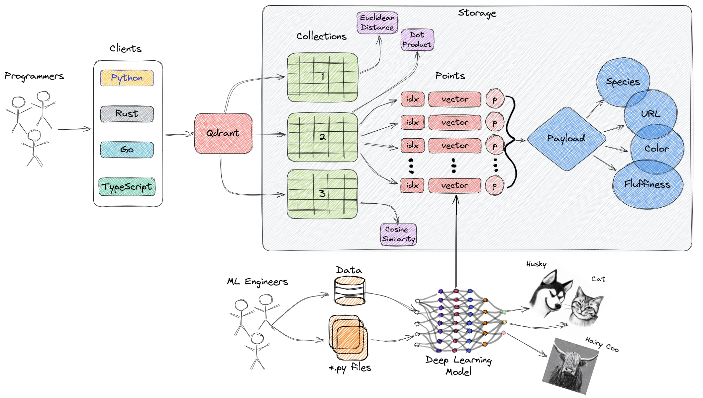
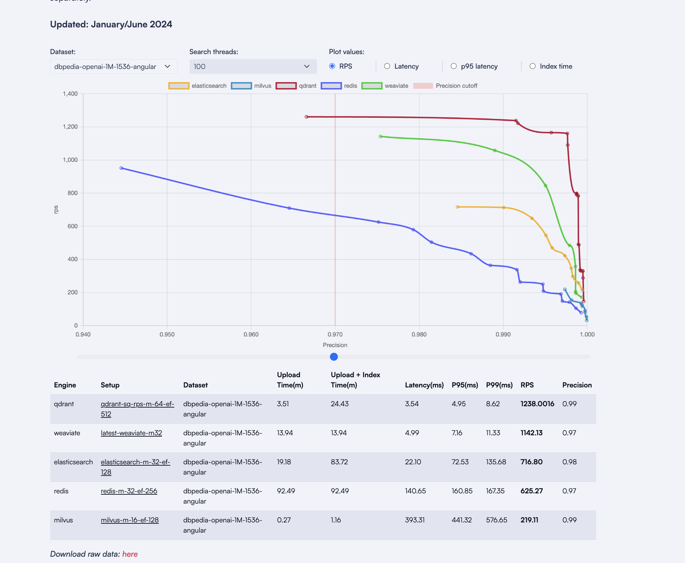
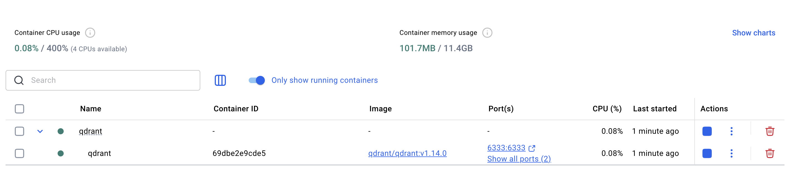
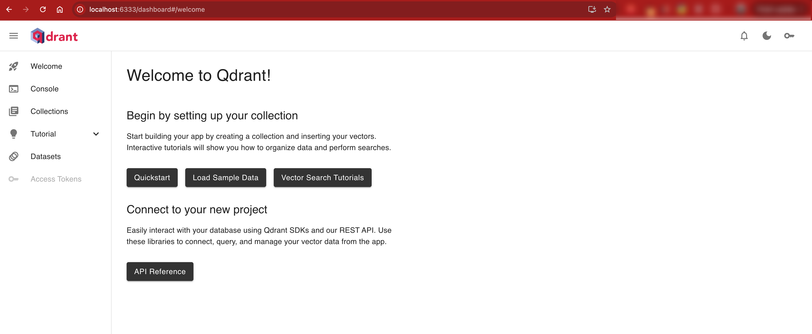
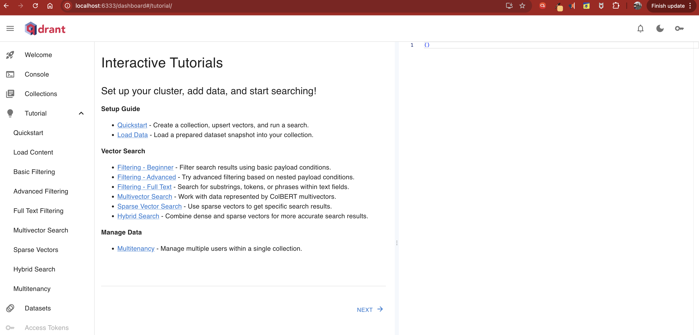
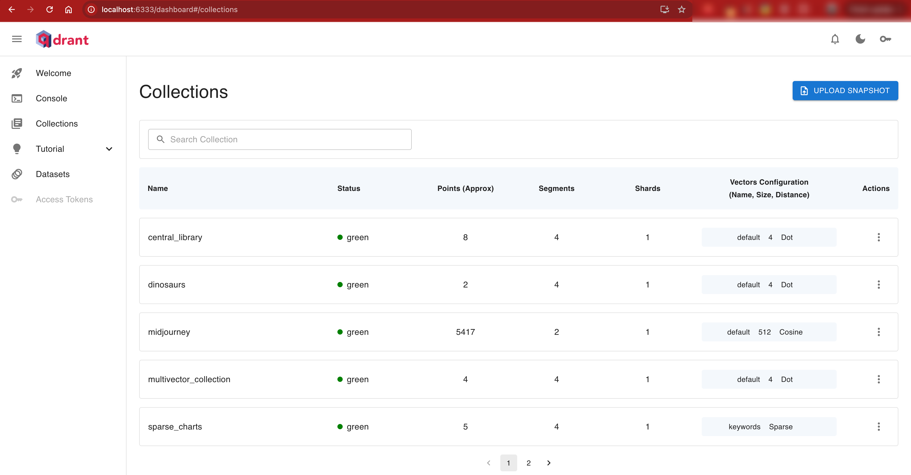

# Qdrant

A lightweight, quick setup of vector database for AI-powered applications — tested with the latest release and fully interactive UI and API tools.

---

## What's about Qdrant

- **License**: Apache 2.0
- **GitHub**: [qdrant/qdrant](https://github.com/qdrant/qdrant)
- **Latest Stable Release**: [v1.14.0 – April 2025](https://github.com/qdrant/qdrant/releases/tag/v1.14.0)
- **Purpose**: Optimized for fast and scalable vector search using **HNSW** (Hierarchical Navigable Small World graphs) with built-in  quantization support only for `int8` now from `float32`.
- **Official High-level Overview**: Refer documentation [here](https://qdrant.tech/documentation/overview/#high-level-overview-of-qdrants-architecture)

 

- **Benchmarks**: Comparing [Qdrant vs Elasticsearch](https://qdrant.tech/benchmarks/)


---

## User Experience

* It is a very clean-UI which built natively which is a plus-point as it is built with the core.
* It is built on [Rust](https://github.com/qdrant/qdrant).
* Qdrant is also available as a fully managed Qdrant Cloud including a free tier which manages the `distributed` cluster framework.
* For Vector Search, it is absolutely capable for compete with Elasticsearch on the Search space but, it is not as broad as Elasticsearch. Instead, it still provides options for K8s observability at a very high-level.

---

## Local Docker Setup

- Very lean setup
```bash
services:
  qdrant:
    image: qdrant/qdrant:v1.14.0
    container_name: qdrant
    ports:
      - "6333:6333"   # HTTP API & Web UI
      - "6334:6334"   # gRPC
    volumes:
      - ./qdrant_storage:/qdrant/storage
    restart: unless-stopped
```

**Exposes:**

* REST API: `http://localhost:6333`
* Native Web UI like Kibana: `http://localhost:6333/dashboard`

### Folder Structure

```
qdrant-docker/
├── docker-compose.yml
├── qdrant_storage/        # Volume to persist data
└── assets/                
```

### Setup Visual



---

## Web UI & API Playground

Qdrant ships with a **built-in minimal UI** accessible at: `http://localhost:6333/dashboard`



The UI is backed by interactive API tools, including the **Swagger-based Console** to test endpoints in real-time.

---

## Vector Search & Indexing

* Qdrant uses **ANN (Approximate Nearest Neighbor)** for efficient retrieval.
* Internally, it supports **`int8` quantization** for memory-optimized vector storage.
* Each index is referred to as a **Collection**.



---

### Example: List Available Collections

API Reference: [Qdrant Collection API](https://api.qdrant.tech/api-reference/collections/get-collection?explorer=true)

Run with `curl`:

```bash
curl http://localhost:6333/collections \
     -H "api-key: xixxxxxxxxxx@xxxxxx2x3"
```

Response:

```json
{
  "result": {
    "collections": [
      {"name": "multivector_collection"},
      {"name": "terraforming_plans"},
      {"name": "sparse_charts"},
      {"name": "dinosaurs"},
      {"name": "central_library"},
      {"name": "terraforming"},
      {"name": "midjourney"},
      {"name": "star_charts"}
    ]
  },
  "status": "ok",
  "time": 0.000053667
}
```



---

* Index documents using vector embeddings from CLIP, BERT, or ColBERT(supports Multivectors)
* Use `curl`, `Python`, or `TypeScript` snippets directly from the API Explorer

---

## Advanced Features

* Multi-vector indexing (ColBERT-style)
* HNSW + quantization
* Payload filtering
* Snapshot backup/restore
* Integrate with LangChain, Haystack, or custom ML pipelines
* Stream data via API or SDKs (Python, JS, gRPC)

---