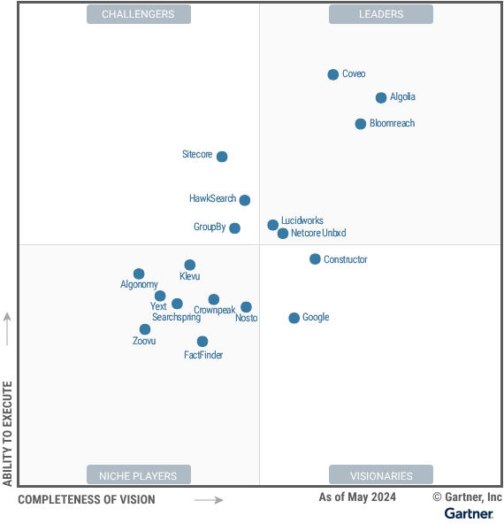
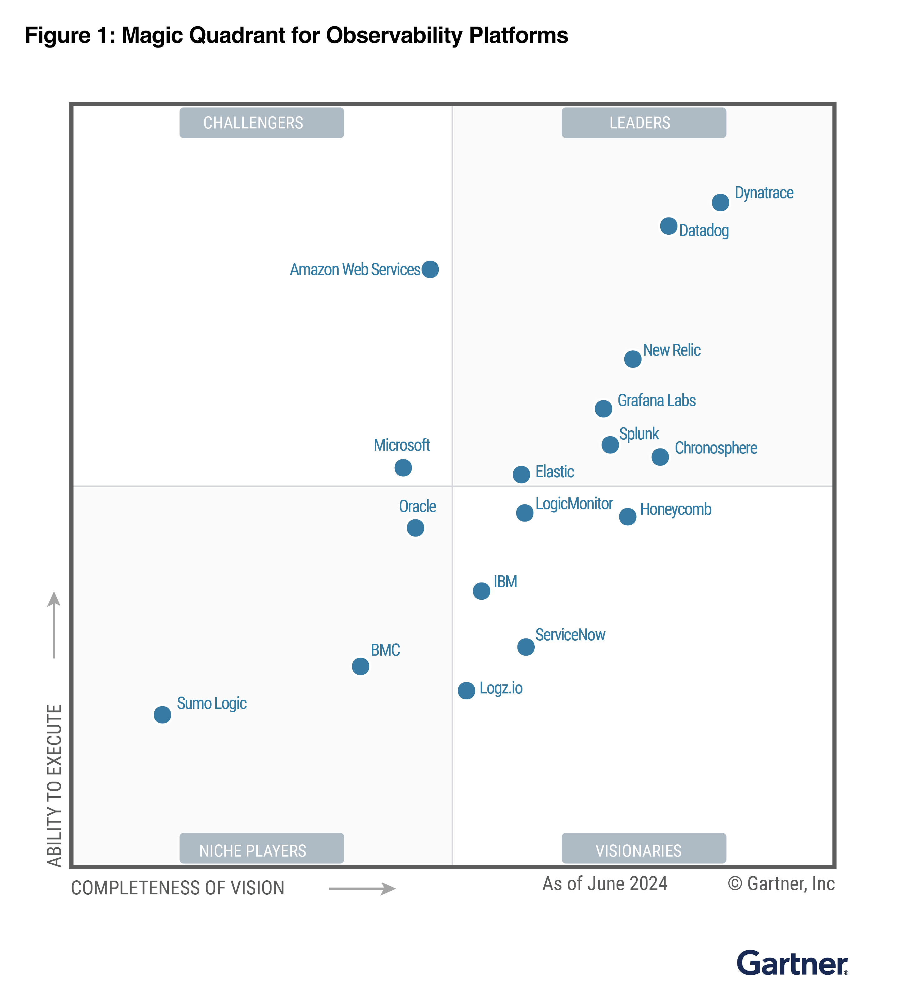

# 🔍 OSS Search & Observability & Security Evaluation

This project compares a range of open-source (and some commercial) tools across search, observability(plus devSecOps), vector search, analytics, and data pipelines.

The goal is to **understand product differentiation**, test **Docker-based performance**, and document **scalability and use cases** with practical hands-on experiments.

---

## 🧭 Categories & Products Evaluated

Evaluated majorly on the Search capabilities on the Elasticsearch side:

[Magic Quadrant for Search and Product Discovery `13 May 2024`](https://www.gartner.com/doc/reprints?id=1-2HL995TP&ct=240516&st=sb&submissionGuid=f9a08ef5-366a-471c-a547-8def5230a591)

We have an `Honorable Mention` in the Search section. I see during the `research`, we were on `release - ~v8.13` where the vector search was not that matured as you see in `v8.16`.

Based on `Magic Quadrant from Gartner 12 August 2024` on the Observability platforms:

---

### 🔍 Search Engines

| Product           | Description                                                | Core Engine   | License                 | Latest Version | Lucene Version |
| ----------------- | ---------------------------------------------------------- | ------------- | ----------------------- | -------------- | -------------- |
| **Elasticsearch** | Full-text, analytics, and vector search with powerful DSL  | Apache Lucene | AGPLv3, SSPL, or Elastic License v2      | 9.0.1          | 10.1.0         |
| **OpenSearch**    | OSS fork of Elasticsearch with similar capabilities        | Apache Lucene | Apache 2.0              | 3.0.0          | 10.1.0         |
| **Solr**          | Apache search engine with customizable schema & faceting   | Apache Lucene | Apache 2.0              | 9.8.1          | 9.11.1          |
| **Vespa**         | Built for AI-powered search at scale, supports on-node ML  | Custom (C++)        | Apache 2.0              | 8.521.17       | N/A            |
| **Meilisearch**   | Lightweight, near-instant search with low resource usage   | Custom (Rust) | MIT                     | 1.7.2          | N/A            |
| **Typesense**     | Fast and typo-tolerant search engine for small-medium apps | Custom (C++)  | GPLv3 (with commercial) | 0.25.1         | N/A            |

---

### 📈 Observability & Monitoring

| Product         | Description |
|-----------------|-------------|
| **Grafana + Prometheus** | Open-source monitoring, alerting, and visualization stack |
| **Splunk**       | Enterprise-grade observability and SIEM platform (proprietary) |
| **Datadog**      | SaaS-based observability platform (proprietary) |

---

### 🧠 Vector Search & AI Indexing

| Product         | Description |
|-----------------|-------------|
| **Elasticsearch** | Supports vector search, hybrid retrieval, and text expansion |
| **Vespa**         | Real-time vector ranking + built-in model inference |
| **PGVector**      | PostgreSQL extension for ANN and cosine similarity |
| **Qdrant**        | Dedicated vector DB with filters and REST/gRPC support |
| **ClickHouse**    | Fast columnar DB with basic vector functionality |
| **Redis** (w/ module) | In-memory vector similarity via Redis-Search or Redis-VSS |

---

### 🛠️ Streaming & Data Pipeline

| Product         | Description |
|-----------------|-------------|
| **Kafka**        | High-throughput distributed event streaming platform |
| **Logstash**     | Classic ELK stack component for transforming & routing logs |
| **Vector**       | Modern, resource-efficient alternative to Logstash |
| **Beats**        | Platform-specific data shippers for collecting telemetry |

---

### 🌐 Web & Product Analytics

| Product           | Description |
|-------------------|-------------|
| **Umami Analytics** | Lightweight, privacy-focused analytics alternative |
| **Google Analytics** | Industry-standard analytics (not OSS) |

---

### 🗄️ Databases

| Product         | Description |
|-----------------|-------------|
| **Couchbase**     | High-performance NoSQL DB with built-in caching |
| **Redis**         | Versatile in-memory store, used for caching and queues |
| **ClickHouse**    | OLAP database for fast analytical queries over large volumes |

---

## 🚀 What's Next?

- 📦 Spin up Docker-based environments for each tool
- 📊 Benchmark indexing & query performance using tools like `wrk`, `ab`, and `htop`
- 📄 Document differences in query syntax, resource usage, and scaling
- 📁 Publish comparative results here and optionally on a blog

> Want to explore a specific category first? Head to the relevant folder:
> - [`elasticsearch/`](./elasticsearch)
> - [`meilisearch/`](./meilisearch)
> - [`qdrant/`](./qdrant)
> - ...

---

## ⚖️ License

This repo is for educational and benchmarking purposes only. Please review each product’s license individually before using in production.

---
