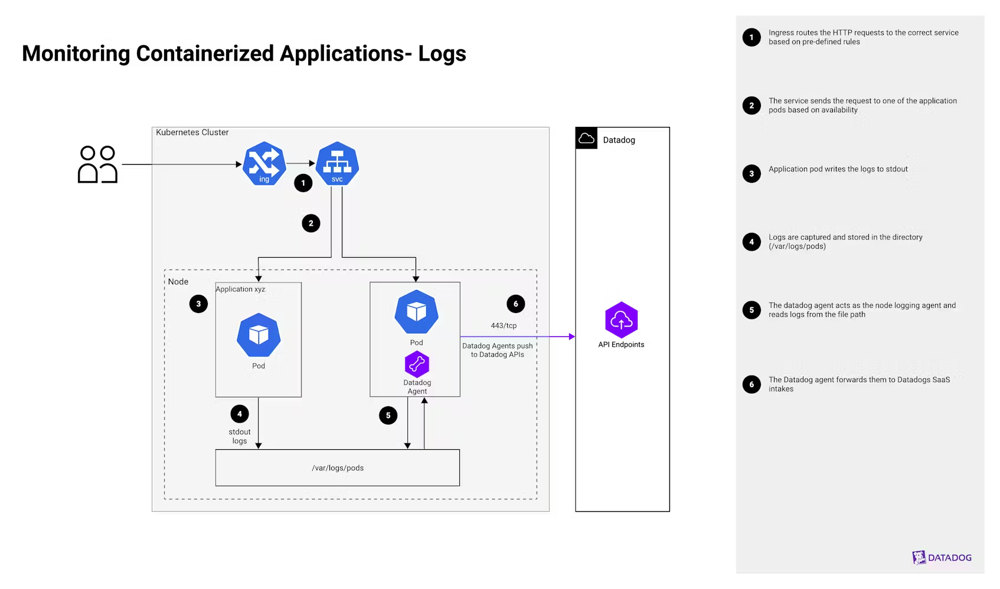
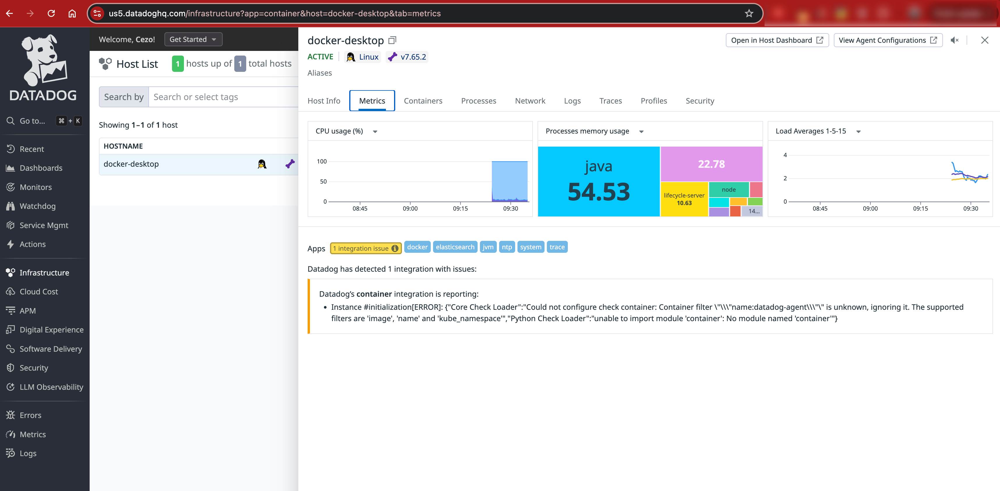
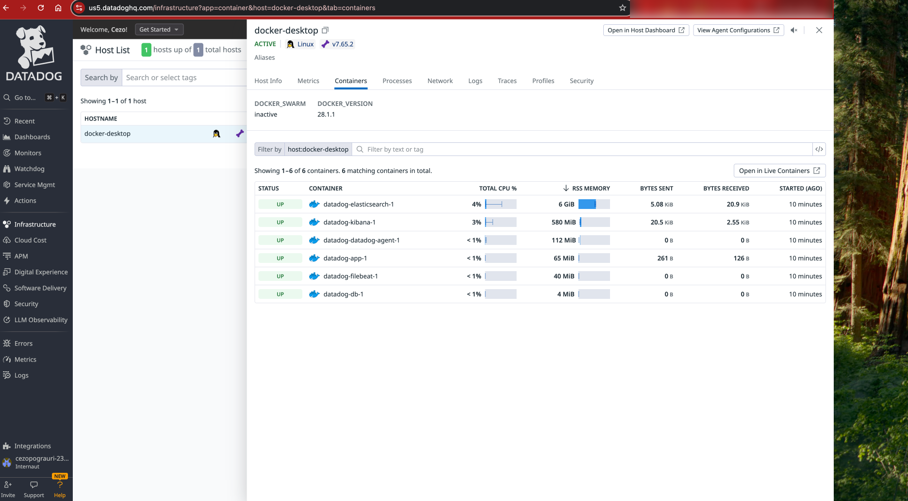
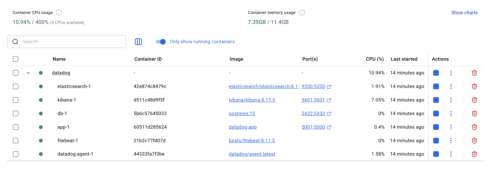

# Datadog

Reference documentation for thedatadog_basic_architecture_setup - https://www.datadoghq.com/architecture/monitoring-container-apps-logs/.

Datadog opensource projects: https://opensource.datadoghq.com/.

local docker setup:

Comparison with the datadog infrastructure capture with the one that I done in the docker side:

