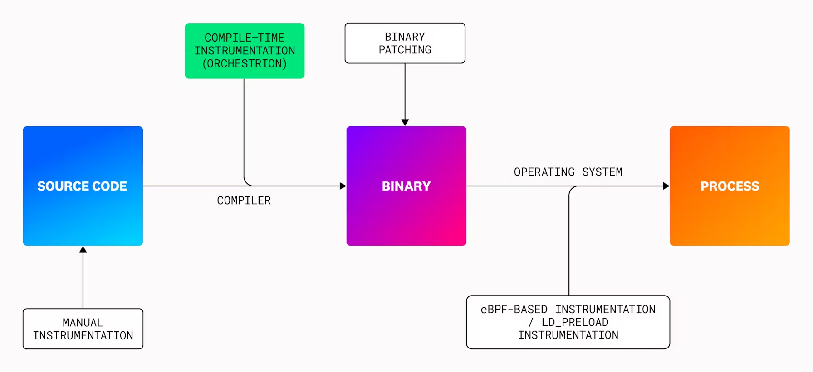
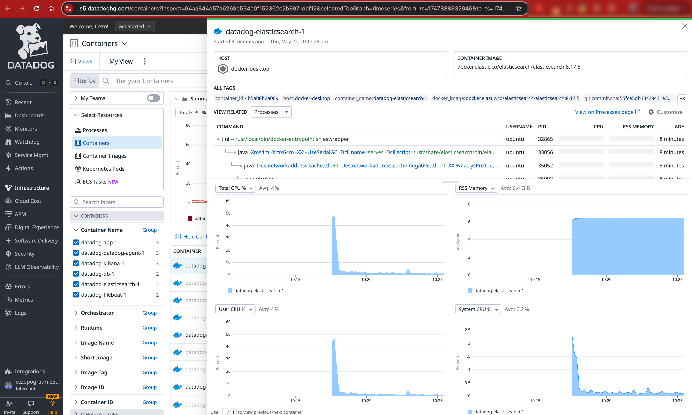
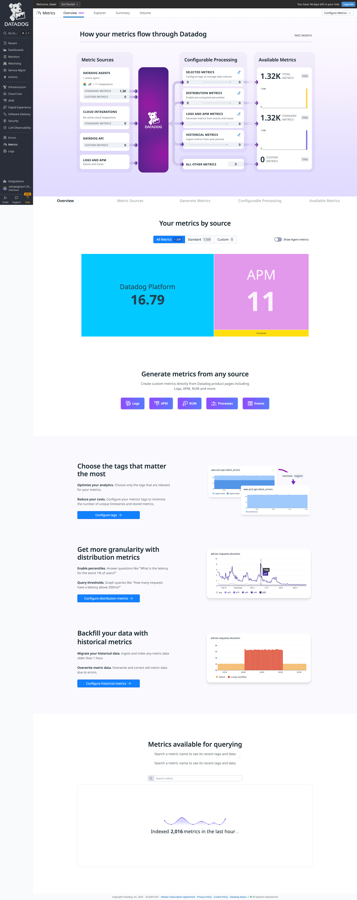
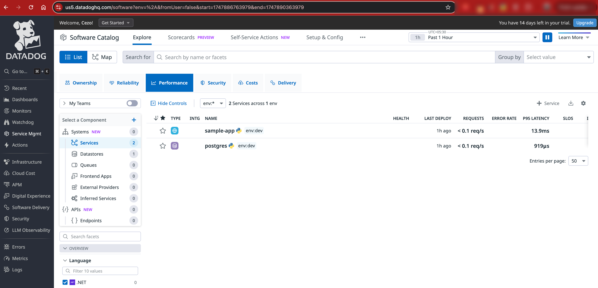

# Datadog

This project demonstrates a local Docker setup with Datadog for monitoring containers and comparing the infrastructure insights with native Docker metrics.

**Reference documentation for the architecture setup:**  
https://www.datadoghq.com/architecture/monitoring-container-apps-logs/

**Datadog Open Source Projects:**  
https://opensource.datadoghq.com/

Datadog actively contributes to the open-source community. Some notable projects include:

* **Vector**: A high-performance observability data pipeline that enables the collection, transformation, and routing of logs and metrics. Vector serves as the backbone for Datadog's Observability Pipelines. Learn more about Vector on the [Datadog Open Source Hub](https://opensource.datadoghq.com/projects/vector/) and the official [Vector website](https://vector.dev/).

* **Orchestrion**: A compile-time instrumentation tool for `Go applications`. Orchestrion integrates directly with the Go toolchain, allowing developers to gain deep visibility into their applications without modifying the source code. More information is available on the [Datadog Open Source Hub](https://opensource.datadoghq.com/projects/orchestrion/) and the [GitHub repository](https://github.com/DataDog/orchestrion).

---

## User Experience

* Datadog operates on a fully managed SaaS model, which means most of the infrastructure and scaling responsibilities are handled by Datadog itself. The only major setup required from the user’s side is the installation and configuration of the Datadog agent. While support is available, it primarily assists with initial setup and best practices rather than deep custom implementation that pushes the `consulting services`.

* Datadog offers approximately 850 out-of-the-box integrations spanning across various services, platforms, and pipelines. Many of these are designed for `plug-and-play` usability, especially for widely adopted technologies—making it extremely convenient for quick onboarding.

* A standout feature is Datadog's support for both **Security** and **LLM Observability**. It enables detailed tracing of logs, metrics, and traces specific to Large Language Model (LLM) applications, capturing user interactions and runtime behavior, and forwarding them into Datadog’s platform for analysis.

* In terms of observability capabilities, Datadog provides broader and deeper integrations compared to Elasticsearch. It includes features for low-level instrumentation such as build-time runtime integrations, software composition analysis, and vulnerability detection. In contrast, Elasticsearch—while powerful—relies on technologies like eBPF, which primarily monitor post-runtime or binary-level behavior, and are comparatively more limited in scope for pre-runtime insights.

---

## Local Docker Setup

This setup includes:

- Docker containers running application workloads
- Datadog Agent configured to collect logs, metrics, and traces
- Integration with Docker socket for container-specific metadata

### Metrics View

View of metrics captured from the local setup:

---

### Infrastructure View

This shows the infrastructure overview captured through Datadog:

---

### Drill-down Container Metrics

### Complete Overview

---

### Services View

---

## Comparison with Native Docker Metrics

A visual comparison between Docker-native metrics and what Datadog captures:

---

Datadog provides detailed observability including:

- System-level resource usage (CPU, memory, disk, network)
- Container-level visibility
- Centralized log collection
- Easy-to-use dashboards with real-time insights

This enhances visibility far beyond what native Docker monitoring can offer.