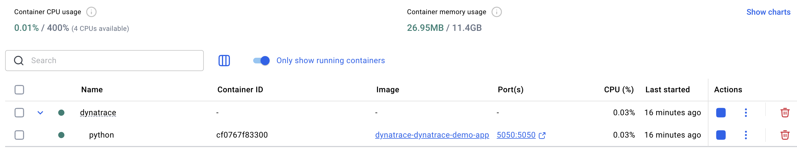
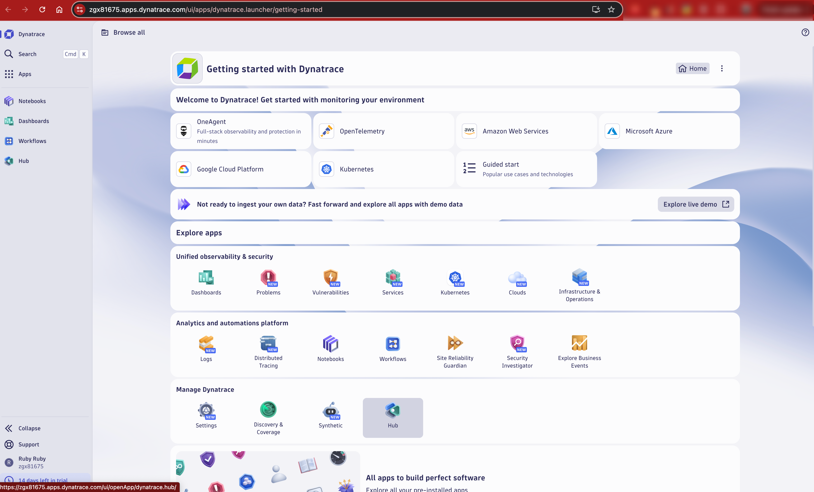
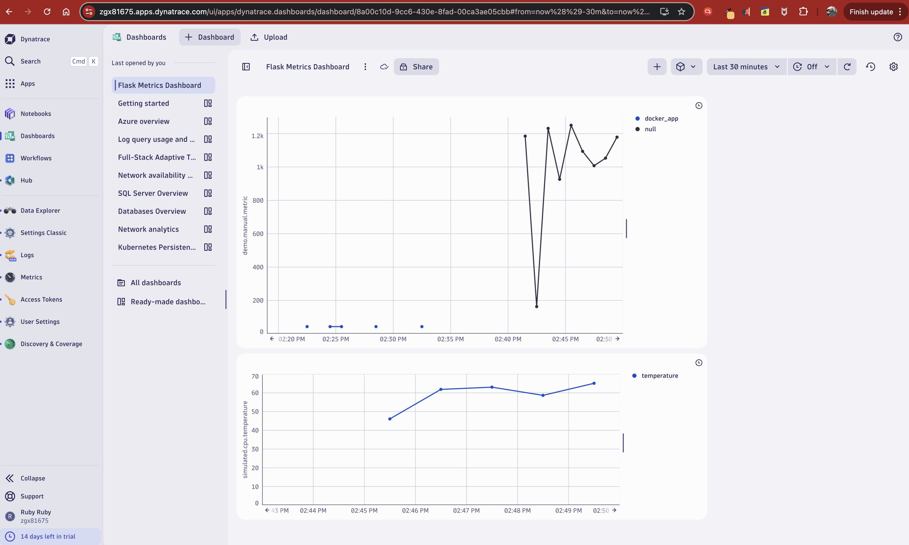

# Dynatrace 

Visualizing in **Dynatrace** using a simple **Python Flask app running in Docker**. It offers a minimal, developer-friendly interface to interact with Dynatrace APIs and explore the platform's real-time observability capabilities.

---

## Setup Overview

We built a Python Flask app that:

- Exposes HTTP routes to simulate and send metrics
- Runs in Docker using `docker-compose`
- Persists logs across container restarts
- Integrates directly with Dynatrace **Metrics Ingest API v2**

**Dynatrace SaaS** receives and visualizes these metrics through its intuitive dashboards.

---

## Features

- `/simulate`: Sends a randomized `demo.manual.metric` between `0–2000`
- `/random-temp`: Sends a random `simulated.cpu.temperature` metric between `40–80°C`
- `/logs`: Displays a persistent log of all metrics sent
- Minimal and responsive Flask UI (API-driven)

---

## How to Run

1. Clone this repo
2. Set up your `.env` file:
   ```env
   DT_ENV_URL=https://<your-env>.live.dynatrace.com
   DT_API_TOKEN=dt0c01.xxxxx.yyyyy
   ```

3. Build and run:

   ```bash
   docker-compose up -d --build
   ```
4. Access the app:

   * [http://localhost:5050/simulate](http://localhost:5050/simulate)
   * [http://localhost:5050/random-temp](http://localhost:5050/random-temp)
   * [http://localhost:5050/logs](http://localhost:5050/logs)

---

## Metrics in Dynatrace

### Custom Metrics Sent:

* `demo.manual.metric` (integer: 0–2000)
* `simulated.cpu.temperature` (float: 40.0–80.0)

Use **Dynatrace Metrics Explorer** or **Dashboards** to view them and **Docker Local Setup**:







---

## User Experience

Dynatrace provides an incredibly **streamlined onboarding experience**.

* The **UI is minimal and intuitive** — even first-time users can navigate metrics and logs effortlessly.
* With **OneAgent** and **API-based ingestion**, setup is lightning-fast.
* You can go from zero to full metric visualization in under 10 minutes.
* Dashboard creation and metric exploration are smooth, filterable, and highly customizable.

---

## Dynatrace & Open Source

Dynatrace actively maintains several open-source projects:

🔗 [github.com/dynatrace-oss](https://github.com/dynatrace-oss)

These include SDKs, extensions, dashboard examples, and API clients — useful for extending observability to custom and cloud-native environments.

---

