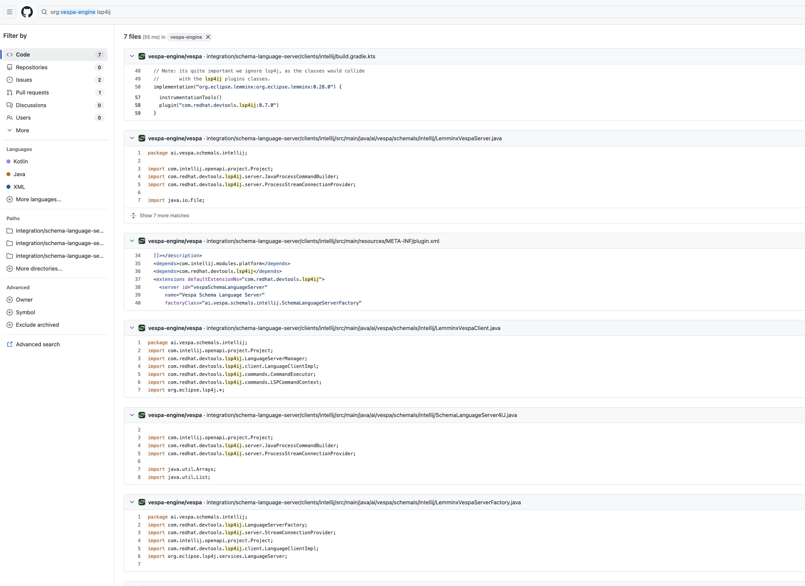

### Syft License Check for Opensearch:
```
syft_licenses % syft opensearchproject/opensearch:latest --output json > opensearch-sbom.json
 ✔ Pulled image                    
 ✔ Loaded image                                                                                                             opensearchproject/opensearch:latest 
 ✔ Parsed image                                                                         sha256:6686312137e0b40b01c80717a04461ad7121f3f411f74514a9cd409f0110c8bd 
 ✔ Cataloged contents                                                                          6ab0b16badbc19c81074a59abf68a6ed4d5b368ad371bf8d262a8ef589c76304 
   ├── ✔ Packages                        [883 packages]  
   ├── ✔ File metadata                   [6,306 locations]  
   ├── ✔ Executables                     [374 executables]  
   └── ✔ File digests                    [6,306 files]  
```

### Syft License Check for Opensearch

```
syft vespaengine/vespa:latest --output json > vespa-sbom.json

 ✔ Loaded image                                                                                                                        vespaengine/vespa:latest 
 ✔ Parsed image                                                                         sha256:66eaeb8d4519587346ffd39d2a5e010ce9dc64788d24ba02ff646bcc8a09e639 
 ✔ Cataloged contents                                                                          f4af23486fa7ce02cb467f07fdbd259a35f2797f90f6cf7165408d7591b91f94 
   ├── ✔ Packages                        [974 packages]  
   ├── ✔ File metadata                   [9,018 locations]  
   ├── ✔ File digests                    [9,018 files]  
   └── ✔ Executables                     [1,133 executables]  
```

https://github.com/HdrHistogram/HdrHistogram - USing Creative Commons and BSD-Clause2.

How Vespa added to the "LSP4IJ" - https://github.com/redhat-developer/lsp4ij using EPL-2.0 license which is weak copyleft.

https://github.com/vespa-engine/vespa/issues/33782



https://github.com/vespa-engine/vespa/commits/master/NOTICES.

No attribution.

https://github.com/elastic/elasticsearch/blob/7c39f26f3d870e02491d2572440cc76fb545e00c/server/licenses/ecs-logging-core-NOTICE.txt