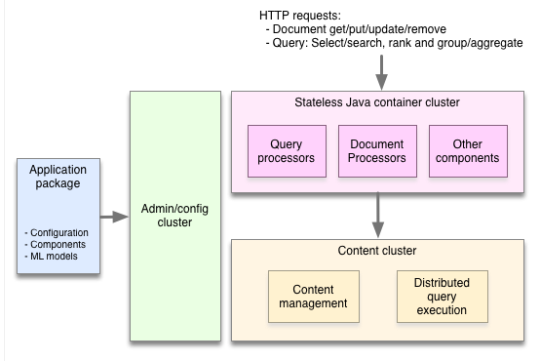
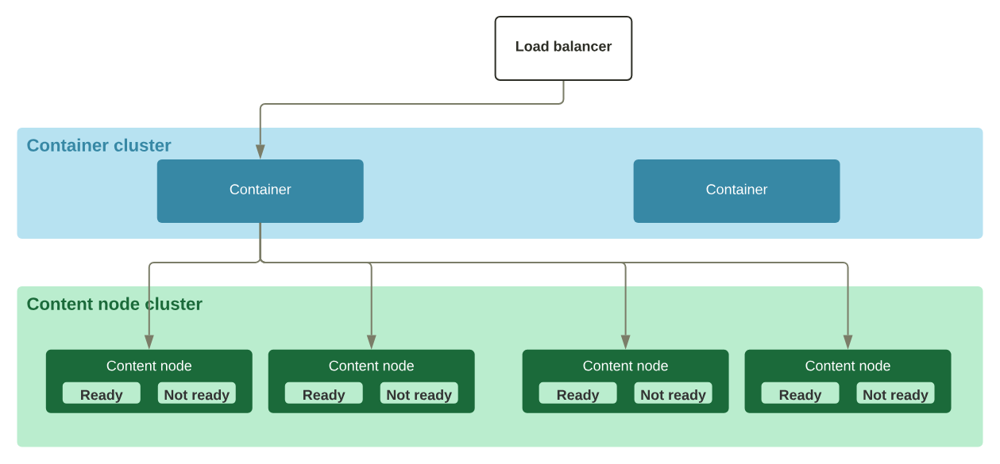
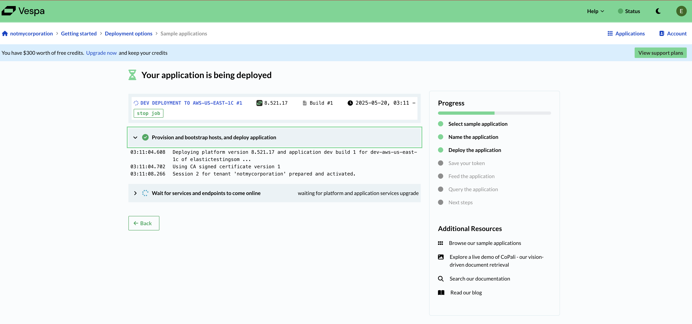
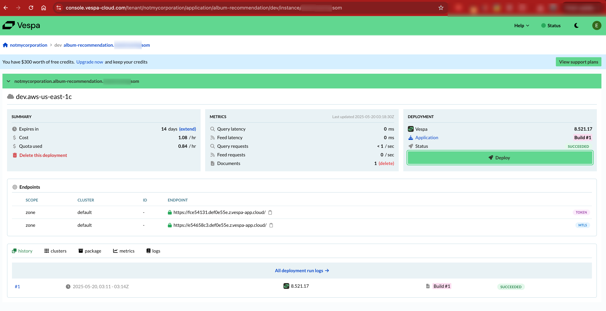

## Vespa Overview

* **GitHub Organization**: [https://github.com/vespa-engine](https://github.com/vespa-engine)
* **Core Repo**: [https://github.com/vespa-engine/vespa](https://github.com/vespa-engine/vespa)
* **License**: [Apache License 2.0](https://github.com/vespa-engine/vespa/blob/master/LICENSE), developed by Yahoo.
* **Direct Comparison with Elasticsearch**: [Vespa vs. Elasticsearch Performance](https://blog.vespa.ai/elasticsearch-vs-vespa-performance-comparison/)
* **Perplexity's Use Case**: [Perplexity Partners with Vespa](https://vespa.ai/perplexity-partners-with-vespa-ai-to-bring-its-search-function-in-house/)
* **Open Sourcing Vespa, Yahoo’s Big Data Processing and Serving Engine**: [Explanation of Vespa Architecture](https://blog.vespa.ai/open-sourcing-vespa-yahoos-big-data-processing/)
* [How **Vinted Engineering** Moved from Elasticsearch of 6 clusters to One Vespa cluster](https://vinted.engineering/2024/09/05/goodbye-elasticsearch-hello-vespa/)



**Elasticsearch comparison** that I see **Vespa** stands out:
* **Written in C++, Vespa avoids JVM garbage collection latency issues — this is a huge advantage in latency-critical applications.**
* **Multi-threaded per query (parallel execution)**

**Elasticsearch discussions** on the `single threaded per query or per shard`:

- [shard-lucene-segments-single-threaded](https://discuss.elastic.co/t/shard-lucene-segments-single-threaded/263696)
- [how-search-works-in-a-single-elasticsearch-shard-lucene-index](https://discuss.elastic.co/t/how-search-works-in-a-single-elasticsearch-shard-lucene-index/35892)
- [one-query-thread-per-shard](https://discuss.elastic.co/t/one-query-thread-per-shard/71744)

Currently **Vespa** is the backend engine for `Flickr`, `Yahoo Finance`, and all `Yahoo Search`.

Pointers where, **Elasticsearch overpowers Vespa**

- [Need a beefy spec to run Vespa atleast 6 GB RAM with 50 GB disk](https://blog.vespa.ai/how-i-learned-vespa-by-thinking-in-solr/)
- No native-orchestration systems to plan autoscaling.
- It still needs to depends on its `Admin + Config Server`(where, the Zookeeper is deployed for the state management which is `Java`)
- Node roles include `config server`, `container node`, `content node`, and optionally `admin node`.

**Data Distribution in Vespa:**


---

## User Experience

* Vespa is a **low-level, CLI-driven platform** for real-time search and inference.
* It does **not rely on Apache Lucene**; instead, it is built from scratch for large-scale content + vector serving.
* Fully **open-source** under Apache 2.0.
* It supports **ANN and vector search**, but does **not come with built-in ML models** - you run your model externally (e.g., Python/Colab), perform embeddings, and ingest into Vespa.
* Queries use **YQL (Vespa Query Language)** - expressive and SQL-like.
* Metrics are exposed via **Prometheus**, enabling Grafana dashboards.
* While powerful, it **lacks a built-in UI**; most tasks are done via CLI, REST APIs, or custom dashboards.
* The **core engine** is primarily written in `C++` (for performance-critical components) and `Java` (for orchestration, configuration, and some application logic)
* Can be deployed in Cloud, on-prem, docker or even in K8s as the images are made available.
* It does not uses a single `master node` in the orchestration or cluster setup, rather it uses content cluster directly. Check this [blog](https://blog.vespa.ai/open-sourcing-vespa-yahoos-big-data-processing/#:~:text=To%20achieve%20both%20speed%20and%20scale%2C%20Vespa%20distributes%20data%20and%20computation%20over%20many%20machines%20without%20any%20single%20master%20as%20a%20bottleneck.) for details.

**Learning curve is deep and requires developer-experience and not user-friendly to no-code users.**

---

## Vespa Interfaces

| Interface               | Description                                                                                         |
| ----------------------- | --------------------------------------------------------------------------------------------------- |
| **Admin Console**       | `http://localhost:19071` — minimal UI showing config server and service bindings                    |
| **REST APIs**           | For indexing, querying, and managing application state — accessible via `curl`, Postman, or scripts |
| **CLI Tools**           | Primary interaction via `vespa-cli` — deploy, inspect, and query apps                               |
| **Grafana Integration** | Exposes Prometheus metrics at `/prometheus/v1`, which can be visualized using Grafana               |
| **Custom UI**           | You can build your own frontend using the search API (`http://localhost:8080/search/`)              |

---

## CLI Tools Summary

| Tool                        | Description                                                                                           |
| --------------------------- | ----------------------------------------------------------------------------------------------------- |
| **`vespa-cli`**             | Official CLI for deployment, app inspection, query execution, and local development                   |
| **`vespa-feed-client`**     | Java-based high-performance client for **bulk document feeding** (newline-delimited JSON format)      |
| **`vespa` container shell** | Shell access to tools like `vespa-deploy`, `vespa-log`, `vespa-stat` from inside the Docker container |
| **REST API + curl**         | Direct HTTP API interaction — fallback option for nearly all use cases                                |

---

## Vespa Local Setup


## Vespa Cloud Setup





Attaching the [Application Package](vespa/assets/notmycorporation.album-recommendation.testingsom.dev.aws-us-east-1c.zip.) used to create the deployment.

```bash
# Directory structure
tree notmycorporation.album-recommendation.testingsom.dev.aws-us-east-1c
.
├── README.md
├── schemas
│   └── music.sd
├── security
│   └── clients.pem
└── services.xml

3 directories, 4 files
```

---

## Postman Collection

* A [Postman collection](oss-eval/vespa/Vespa.postman_collection.json) is included with sample response from the APIs for:

  * Document ingestion
  * Search
  * Metrics
  * Application status

---