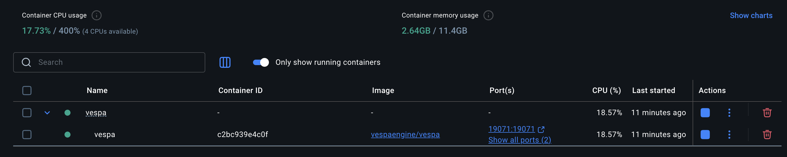

https://github.com/vespa-engine

https://github.com/vespa-engine/vespa

Direct comparison with Elasticsearch: https://blog.vespa.ai/elasticsearch-vs-vespa-performance-comparison/

Perplexity uses Vespa: https://vespa.ai/perplexity-partners-with-vespa-ai-to-bring-its-search-function-in-house/

| Tool                    | Description                                                                                                         |
| ----------------------- | ------------------------------------------------------------------------------------------------------------------- |
| **Admin Console**       | Available at `http://localhost:19071` — very minimal, shows API bindings and health                                 |
| **REST APIs**           | Document insert, search, status — all via `curl`, Postman, or CLI                                                   |
| **CLI Tools**           | [`vespa-cli`](https://docs.vespa.ai/en/vespa-cli.html) for deploying apps, feeding documents, checking status       |
| **Grafana Integration** | Vespa exposes **Prometheus metrics** at `/prometheus/v1`, which you can connect to Grafana for real-time dashboards |
| **Custom UI**           | You can build your own frontend by querying `http://localhost:8080/search/` and rendering results                   |

**CLI Tools**
| Tool                        | Description                                                                                              |
| --------------------------- | -------------------------------------------------------------------------------------------------------- |
| **`vespa-cli`**             | Official CLI to deploy apps, check status, run queries, manage instances                                 |
| **`vespa-feed-client`**     | High-performance Java tool to **bulk feed documents**                                                    |
| **`vespa` container shell** | Run `vespa-*` scripts like `vespa-deploy`, `vespa-log`, `vespa-stat`, etc., inside your Docker container |
| **REST API + curl**         | RESTful fallback for nearly everything                                                                   |

Adding `Postman Collection`(oss-eval/vespa/Vespa.postman_collection.json) for reference with the APIs that we have.